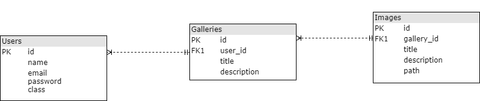

# Разработка сервиса хостинга изображений для студентов Нетологии

Сервис изображений должен поддерживать следующие функции:
- Регистрацию и авторизацию пользователей.
- Создание галерей изображений для зарегистрированных пользователей.
- Загрузку в галереи произвольного количества изображений.
- Галереи и изображения могут содержать заголовки и описания.
- Пользователь может формировать прямые ссылки на изображения.
- Пользователь может удалять галереи и отдельные изображения.

## Реализация

- Система реализована на базе фреймворка PHP Laravel.
- Использована MVC архитектура.
- Все компоненты реализованы с использованием ООП.
- В качестве шаблонизатора использован Blade, поскольку он входит в состав фреймворка.
- Данные пользователей, галерей, которые они создают, и сведения об изображениях в галереях хранятся в СУБД MySQL.

Схема базы данных:


## Инструкция по первому запуску
- Установить php7.1+
- Установить composer
    ```https://getcomposer.org/```
- Установить laravel
    ```composer global require "laravel/installer"```
- Склонировать проект из репозитория Github
    ```git clone https://github.com/ykornilov/imgservice.git```
- Перейти в директорию проекта
- Обновить проект laravel
    ```composer update --no-scripts```
- Добавить в MySQL базу данных и пользователя, и внести соответсвующие записи в файл .env (на базе файла .env.example)
- Изменить значение поля APP_NAME в файле .env с Laravel на ImgService
- Сгенерировать ключ
    ```php artisan key:generate```
- Проверить app/Providers/AppServiceProvider:
    ```use Illuminate\Support\Facades\Schema;

    /**
     * Bootstrap any application services.
     *
     * @return void
     */
    public function boot()
    {
        Schema::defaultStringLength(191);
    }
    ```
- Выполнить миграции:
    ```php artisan migrate```
- Инициализировать администратора
    ```php artisan db:seed```
- Перенести проект на хостинг, изменив файл .env в соответствии с настройками базы данных хостинга и переименовав директорию public в директорию, на которую настроен веб-сервер хостинга
- Сделать дамп базы данных и импортировать его на хостинг
